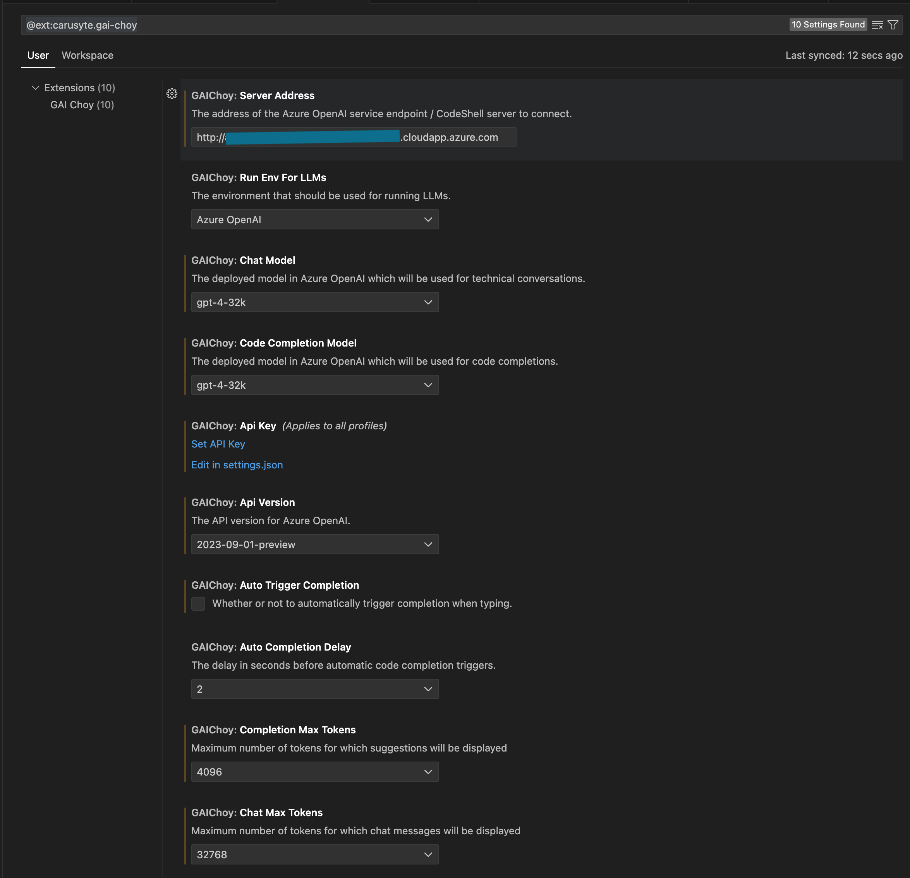

# GAI Choy VSCode Extension

GAI Choy stands for **G**enerative **AI** empowered, **C**ode **H**elper **O**n **Y**our side.

Gai Choy, also known as Chinese mustard greens, is a type of leafy vegetable having a distinct, pungent flavor that is often described as spicy, slightly bitter, or peppery. Its strong flavor makes it a popular choice for adding depth and complexity to a variety of dishes. Despite its toughness, it becomes tender and more palatable when cooked, making it a versatile ingredient in the kitchen.


This project is forked from [codeshell-vscode](https://github.com/WisdomShell/codeshell-vscode), with additional support for Azure OpenAI (AOAI) service integration and a couple of other enhancements. See [NOTICE](NOTICE) for more details.

The `GAI Choy` project is an open-source plugin developed based on the [CodeShell LLM](https://github.com/WisdomShell/codeshell) and Azure OpenAI service that supports [Visual Studio Code](https://code.visualstudio.com/Download). It serves as an intelligent coding assistant, offering support for various programming languages such as Python, Java, C/C++, JavaScript, Go, and more. This plugin provides features like code completion, code interpretation, code optimization, comment generation, and conversational Q&A to help developers enhance their coding efficiency in an intelligent manner.

## Why another extension for AOAI?

Here's an exhuastive list of extensions I tried:

- [openai-vscode](https://marketplace.visualstudio.com/items?itemName=AndrewButson.vscode-openai)
  - No code-completion feature
  - Does not seem to support [clustered AOAI setup behind Azure Application Gateway](https://github.com/denlai-mshk/aoai-fwdproxy-funcapp)
  - Not open sourced
- [Code GPT](https://marketplace.visualstudio.com/items?itemName=DanielSanMedium.dscodegpt)
  - Similar to the above. Although it provides audo-code-completion feature, the supported model is limited without plus-subscription.<br/>

## How to Install the Extension

### Option 1 - Install from Extensions Marketplace

Search "GAI Choy" in your Extensions tab in VSCode and install the plugin from there.
[VS Code Extension - Gai Choy](https://marketplace.visualstudio.com/items?itemName=Carusyte.gai-choy)

### Option 2 - Offline Installation

1. Download the latest .vsix file from the [Releases](https://github.com/carusyte/GAI-Choy/releases)
2. Navigate to Extensions tab in your VSCode
3. Click the "..." button to the top-right
4. Click "Install from VSIX..." and choose the downloaded .vsix file to install the extension.

## Requirements to Build from Source

- [node](https://nodejs.org/en) version v18 and above
- Visual Studio Code version 1.68.1 and above
- *Optional:* The [CodeShell](https://github.com/WisdomShell/llama_cpp_for_codeshell) service is running (not required for AOAI integration)

## Compile the Plugin

If you want to run the package from source code, you need to execute the following command:

```zsh
git clone https://github.com/carusyte/GAI-Choy.git
cd GAI-Choy
npm install
npm exec vsce package
```

and it will create a visx package file like: `gai-choy-${VERSION_NAME}.vsix`。

## Model Service

### Azure OpenAI (AOAI) service

The [AOAI service](https://azure.microsoft.com/en-us/products/ai-services/openai-service) setup varies depending on how your cloud infrastructure is designed and implemented. Here's [how-to article](https://learn.microsoft.com/en-us/azure/ai-services/openai/how-to/create-resource) to get you started. For more production-grade setup you may consult cloud architect, engineer or SRE.

### CodeShell model

Note that this step is not required for AOAI integration. Please refer to [source repo's README.md](https://github.com/WisdomShell/codeshell-vscode/blob/main/README_EN.md#model-service) for details.

## Configure the Plugin

- Set the address for the CodeShell / AOAI service
- Configure whether to enable automatic code completion suggestions
- Set the time delay for triggering automatic code completion suggestions
- Specify the maximum number of tokens for code completion
- Specify the maximum number of tokens for Q&A
- Configure the model runtime environment

Note: Different model runtime environments can be configured within the plugin. For the [CodeShell-7B-Chat-int4](https://huggingface.co/WisdomShell/CodeShell-7B-Chat-int4) model, you can choose the `CPU with llama.cpp"`option in the `Code Shell: Run Env For LLMs` menu. However, for the [CodeShell-7B](https://huggingface.co/WisdomShell/CodeShell-7B) and [CodeShell-7B-Chat](https://huggingface.co/WisdomShell/CodeShell-7B-Chat) models, you should select the `GPU with TGI toolkit` option.

To use Azure OpenAI service as the LLM model, there're additional parameters that need to be configured:

- Chat model deployed in Azure
- Completion model deployed in Azure
- API Key
- API version



## Features

### 1. Code Completion

- Automatic Code Suggestions
- Keyboard Shortcut for Code Suggestions

During the coding process, code completion suggestions can automatically trigger when you pause input (configurable with the `Auto Completion Delay` option, set to 1-3 seconds). Alternatively, you can manually trigger code completion suggestions using the shortcut key `Alt+\` (for Windows) or `Option+\` (for Mac).

When the plugin provides code suggestions, the suggested content appears in gray at the editor's cursor position. You can press the Tab key to accept the suggestion or continue typing to ignore it.


### 2. Code Assistance

- Explain/Optimize/Cleanse a Code Segment
- Generate Comments/Unit Tests for Code
- Check Code for Performance/Security Issues

In the VSCode sidebar, open the plugin's Q&A interface. Select a portion of code in the editor, right-click to access the CodeShell menu, and choose the corresponding function. The plugin will provide relevant responses in the Q&A interface.


### 3. Code Q&A

- Support for Multi-turn Conversations
- Maintain Conversation History
- Engage in Multi-turn Dialogues Based on Previous Conversations
- Edit Questions and Rephrase Inquiries
- Request Fresh Responses for Any Question
- Interrupt During the Answering Process


Within the Q&A interface's code block, you can click the copy button to copy the code block or use the insert button to insert the code block's content at the editor's cursor location.

## License

Apache 2.0

## Attribution

- [Illustration Vectors by Vecteezy](https://www.vecteezy.com/free-vector/illustration)
- [Mustard greens by iconnut from Noun Project (CC BY 3.0)](https://thenounproject.com/browse/icons/term/mustard-greens/)

## Star History

[](https://star-history.com/#carusyte/GAI-Choy.git&Date)
